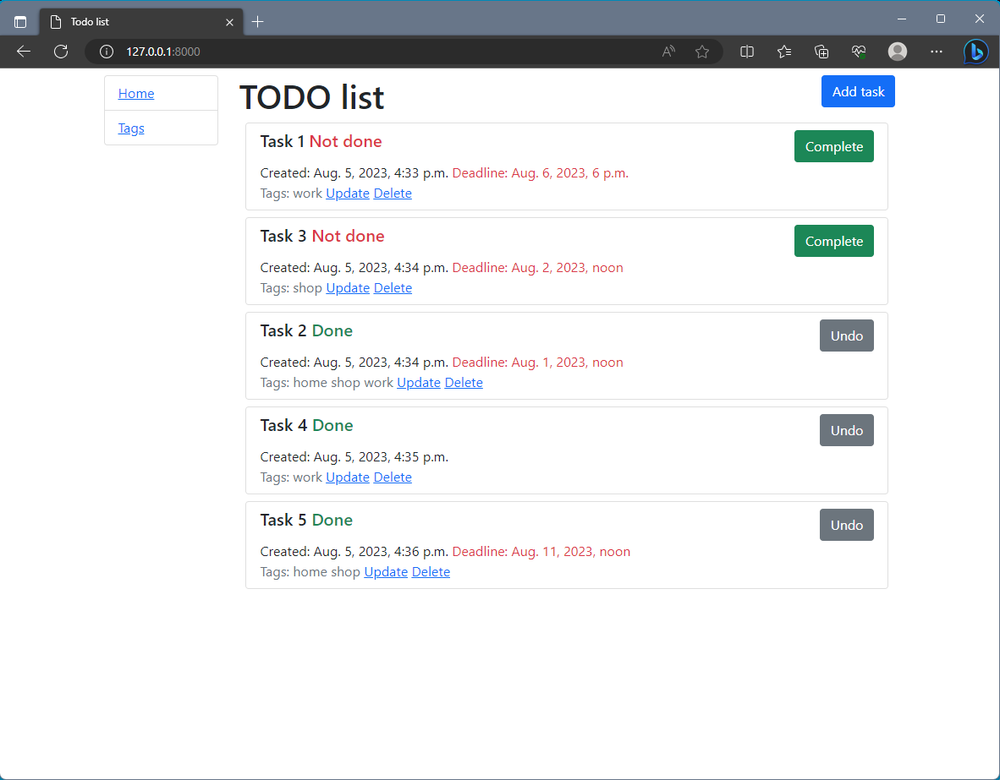
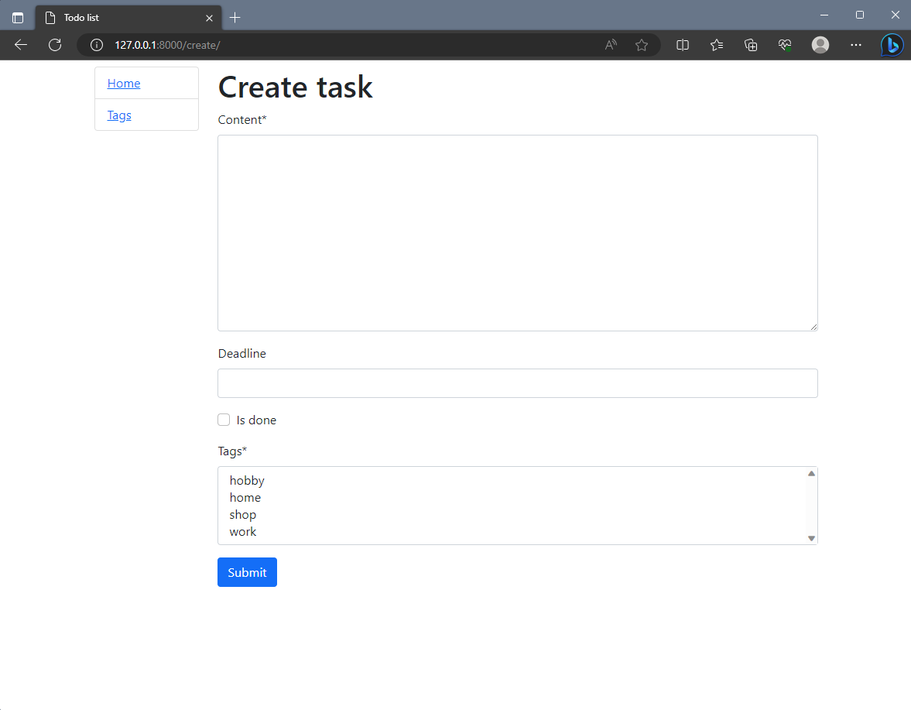
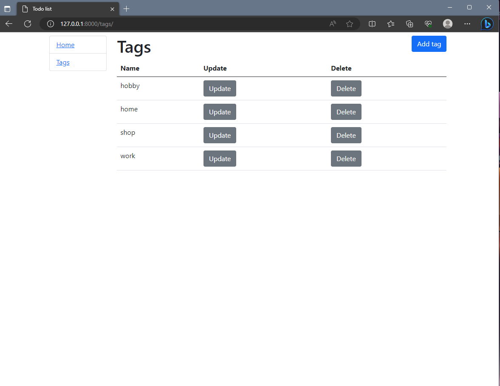

# todo-list
A practice project to implement a todo list site

## Quick Start

To get this project up and running locally on your computer:

1. Python3 must be already installed

2. Assuming you have Python setup, run the following commands (if you're on Mac you may use `python3` instead of `py` to
   start Python):
   ```
   git clone https://github.com/Sashkoooo/todo-list
   py -m venv venv
   venv\Scripts\activate (on Windows)
   source venv/bin/activate (on macOS)
   pip install -r requirments
   py manage.py makemigrations
   py manage.py migrate
   py manage.py createsuperuser # Create a superuser
   py manage.py runserver
   ```
3. Open a browser to `http://127.0.0.1:8000/admin/` to open the admin site
4. Create a few test objects of each type.
5. Open tab to `http://127.0.0.1:8000` to see the main site, with your new objects.

## Overview

This web application creates todo list, where you can create tasks, tags and mark tasks as done.
Tag symbolizes the theme of the task and consists only of a name.
A task can have multiple tags and a tag can be in multiple tasks.

The main features that have currently been implemented are:

* Models for task and tags.
* User can:
  * view home page with all tasks and detail information in general
  * create new tasks
  * update and delete tasks
  * mark the task as done or not done by using a toggle button
  * create new tags
  * update and delete tags

## Demo



